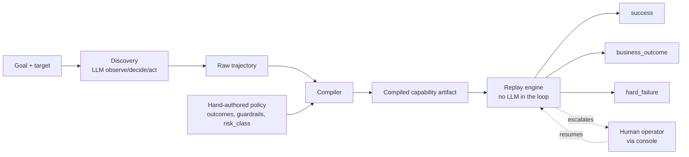
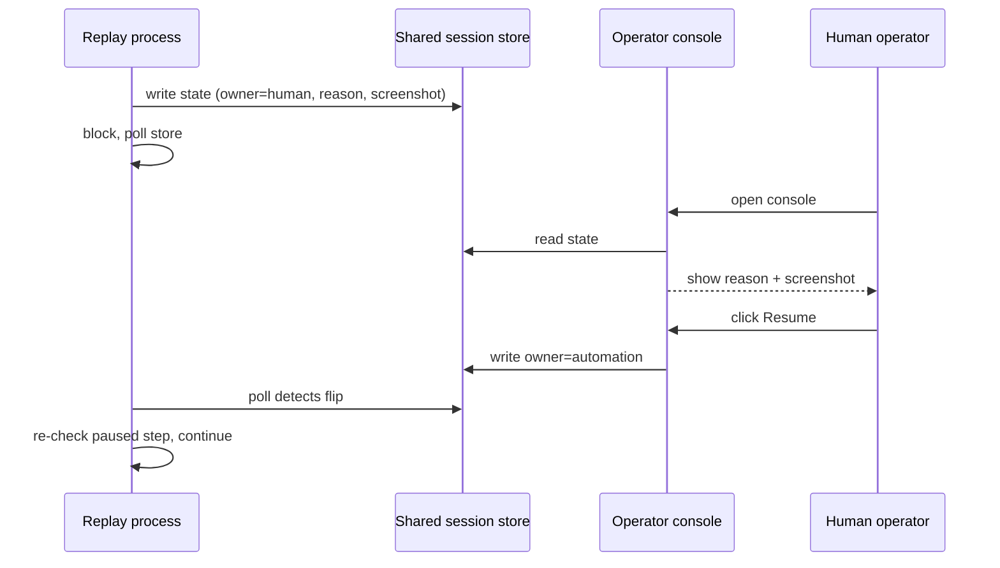

# Design Report — hands-off

## 1. Architecture

The system is built around one governing idea: discovery and replay are two different programs that share one contract. Discovery is an LLM-driven observe/decide/act loop — slow, non-deterministic, expensive, and run exactly once per capability. Replay executes the same flow with no model in the decision loop — fast, cheap, deterministic, and run every time an AI agent actually needs the capability in production. The artifact is the seam between them: what discovery proves, replay trusts.

Perception is accessibility-tree-first rather than screenshot-or-coordinate-based, for a specific reason: it's the same abstraction the replay engine's locators are built on, so what the model reasons over during discovery and what the compiler turns into a locator are already speaking the same language. A screenshot-based agent would have required a translation step between "what the model saw" and "what the artifact can reliably re-find" — accessibility-tree-first removes that translation step entirely.

A handful of architectural choices were made to keep the system's core abstractions honest rather than broad. Locator resolution, checkpoint evaluation, and action execution are each implemented as a small registry of independent functions rather than one large dispatch function — a new type is added by registering a function, not by editing a shared core. Escalation uses a single process that owns a real, visible browser directly, with a shared session store and a minimal separate operator console, rather than a full RPC service that proxies browser control across a network boundary — a deliberate simplification, discussed further in Cuts. The agent-facing capability API added as a stretch goal is a thin wrapper around the same `run_capability()` the CLI uses, not a parallel implementation — there is exactly one way this system executes a capability, invoked from two different entry points (the CLI and the HTTP API).

## 2. Artifact schema

The central design decision in this system is that a compiled capability artifact only ever contains what a discovery run actually verified. Steps, locators, and per-step targeting come from a mechanical layer, derived directly from a successful trajectory. `expected_outcomes`, `escalation_policy`, `guardrails`, and `risk_class` come from a separately authored policy layer, merged in at compile time. Neither layer overrides the other.

This split exists because a single successful discovery run structurally cannot observe failure states. It never sees "member not found," because it never fails to find a member. Any compiler that tried to auto-generate `expected_outcomes` from a happy-path trajectory would be fabricating them. So the artifact treats "what happened" and "what should be permitted, expected, or escalated" as two different kinds of knowledge with two different sources of truth.

Checkpoints reflect this split directly. Every non-final checkpoint is `any_of[element_visible(next step's target), outcome_match(the policy's declared outcome codes)]` whenever the policy declares at least one expected outcome — which is the current shape for every shipped capability. Without the `outcome_match` branch, a business-outcome screen such as "member not found" would never satisfy a plain `element_visible` check, and a replay would hang indefinitely waiting for a state that was never coming (see Section 3). The `element_visible` half of the check is derived mechanically, not guessed: a step's target is that the very next successful action's locator became visible, which is proof rather than an assumption, since that next action could only have succeeded because this step's effect made it possible.

Locator targeting is not uniform across step types, and the schema doesn't pretend it is. `click`/`type` steps carry a ranked pair of strategies — accessibility role and name first, a text-label fallback second. Extract steps are different: because label and value cells share an identical accessibility role in this application's markup, the compiler resolves extract targets by label match alone (`role: "cell"`, `name_matches` against the field's label), with no text-label fallback — a form-label lookup doesn't apply to a plain table cell, so a second strategy there would be decorative rather than functional. `navigate` steps carry no locator at all, and the `extract` action itself has no step-level locator — each declared output field carries its own. The schema is honest about this variation rather than forcing every step into the same shape for the sake of uniformity.

Compiled locators only ever contain strategies discovery actually verified. A synthesized CSS fallback was deliberately left out of the compiler (see Cuts) — inventing one the system never tested against a live page would be the same category of dishonesty the mechanical/policy split is designed to avoid elsewhere.

## 3. Determinism & error handling

The premise underlying record-once/replay-many is that a legacy UI is stable enough to make deterministic replay viable at all — tested directly by running the same compiled capability against the same input eight times in a row and confirming eight successes with no variance beyond ordinary network timing (`evidence/stability/`). Every replay resolves to exactly one of three outcomes:

| Outcome | Meaning | HTTP status (capability API) |
|---|---|---|
| `success` | Goal achieved, declared outputs returned | 200 |
| `business_outcome` | A legitimate, expected non-happy-path result (e.g. "member not found") | 200 |
| `hard_failure` | Something genuinely unexpected — needs investigation | 500 |

A business outcome — "no such member," "access denied" — means the automation worked correctly and reached a legitimate, expected end state; it is returned as a normal result, never as an error. A hard failure means something genuinely unexpected happened, and the result carries which step, what was expected, and what was observed, plus a screenshot when the artifact's evidence policy calls for one on that outcome (configurable per artifact, not guaranteed universally). Conflating the first two is, in our experience building this, the easiest mistake to make and the most damaging one to ship, because it turns every legitimate "no" into a page for a human.

That distinction was tested against real failure, not assumed. Three bugs found during verification are worth describing directly, because each demonstrates a different way "looks correct" and "is correct" can diverge in a system like this:

**Checkpoints and expected outcomes were compiled but never wired together.** Early compiled artifacts could reach a business-outcome screen and simply hang — the checkpoint logic and the outcome-detection logic existed independently, and a plain `element_visible` checkpoint had no way to recognize "no results table, but a not-found message" as a valid way to pass. The fix is the `any_of` wrapping described in Section 2.

**Compiled artifacts only ever worked for the member they were recorded against.** The first fully working version of this system passed every test we had — until we specifically replayed the escalation capability against the compiled artifact using a different member than the one discovery was recorded against. It failed, correctly, with a clean hard failure: the extraction step's locator had been compiled from the *literal value* seen during discovery ("Jane Doe"), not from the field's label, so the capability could only ever round-trip the one member it was built from. The fix compiles extract locators from the field's label instead. Fixing this exposed a second, dormant bug: the accessibility role originally assumed for label cells (`text`) never existed in this application's real markup, so the compiler's and the hand-authored reference schema's locators were corrected to the real role (`cell`). But role alone still can't distinguish a label cell from a value cell, since both share it — the actual detection logic that tells the two apart doesn't key on role at all. It reads the resolved element's own text and checks whether it ends in `:`, the same label signal already used by the redaction logic elsewhere in this system. This is the clearest demonstration in the project that a locator or a detection rule is only as good as its last live verification — and it was caught specifically because the test matrix included a member other than the one discovery was recorded against.

**Resuming an escalated run initially replayed the paused step's action, not just its check.** For a read-only capability this was invisible; for anything mutating, resuming after a human hand-off would have re-submitted the original action — a double-click on a confirm button, a duplicate transfer. The fix splits every step into an independent act phase and check phase, so any retry, automatic or human-resumed, only ever re-verifies, never re-acts.

## 4. Heterogeneity & multi-tenant

This system was implemented against one concrete surface — a legacy-style web application — and the desktop-surface argument below is design, not a claim of what was built, consistent with the brief's own note that a second surface is not expected. The multi-tenant claim, however, was tested: see the cross-tenant result below.

The credibility of the extension story rests entirely on the perception choice made in Section 1. Accessibility role and name is not a web-specific concept — it's the same abstraction Windows exposes for native applications through UIA, and the same idea screen readers rely on generally. The seam between "how the system perceives and acts on a surface" and "the recorded flow" is the locator-resolution registry described in Section 1: a desktop surface would mean writing a new set of locator-strategy and action functions against a different underlying API, registered under the same interface the web strategies already use. Nothing in the artifact schema, the checkpoint logic, or the replay engine's control flow would need to change, because none of those layers know or care what kind of surface produced the accessibility data they're working with.

**The multi-tenant claim was tested, not just argued.** `target_app_tenant_b/` is a second Flask app serving the same search → results → detail flow, branded as a different institution ("Northbrook Community Credit Union" vs. tenant A's "First Meridian Trust & Savings"): a different CSS palette and font, a flexbox/card layout instead of tenant A's nested `<table>` shell, a `<ul>` results list instead of a `<table>`, and a fully distinct `cu-*` class-naming scheme with zero overlap with tenant A's `frmOuter`/`dtlCell`/`c1`/`c2` classes — and a separate member database. The one thing held constant, deliberately, is every interactive element's accessible role and name: the same `<label>Member ID</label>`, the same `Search` button text, a results link whose accessible name is still the bare member ID, and detail-page cells still named `Name:` / `Savings Balance:`.

The already-compiled `member_balance_lookup.compiled.json` — recorded once against tenant A and never touched since — was replayed unmodified against tenant B (`member_id=20001`, tenant B's seeded happy-path member): `status: "success"`, `member_name: "Alice Nguyen"`, `savings_balance: 8390.55`. A second run against an unseeded ID (`29999`) correctly reached `status: "business_outcome"`, `outcome_code: "MEMBER_NOT_FOUND"` — the same `expected_outcomes` detection working against tenant B's differently-styled empty-results markup. Zero code or artifact changes between the tenant A and tenant B runs — same JSON file, replayed against a copy with only `target.entry_point`/`target.app` repointed at tenant B's own port (`target_app_tenant_b` runs concurrently with `target_app` on a separate port, not in place of it — see `target_app_tenant_b/README.md`), since the artifact's `target.entry_point` is what the guardrail's origin check derives from, not wherever the browser happens to navigate. Inspecting `log.jsonl` from both runs confirms every one of the seven locator resolutions across both steps resolved via the primary `accessibility` strategy on the first attempt — never fell through to the `text_label` fallback. That's the strongest form of the locator-targeting claim: not merely "it still worked" but "styling and DOM-shape drift produced zero measurable perception cost." Evidence saved at `evidence/replays/cross_tenant_b_success_20001/` and `evidence/replays/cross_tenant_b_not_found_29999/`.

This was, deliberately, a single-session, happy-path-plus-not-found test — not the full five-outcome matrix tenant A has (access-denied, slow-load, interstitial were not re-seeded on tenant B; see `target_app_tenant_b/README.md`). The result converts one specific claim from "untested bet" to "tested once, passed cleanly," not a claim that every fault path is tenant-agnostic. The underlying detection mechanism for when the bet stops holding is unchanged and still real: every locator resolution attempt, including which ranked strategy actually succeeded, is logged. A capability that begins consistently falling through to a lower-priority strategy, or fails to resolve at all, is a concrete operational signal that a given tenant's version has drifted — the trigger for re-recording or authoring a tenant-specific override, rather than something failing silently in production.

## 5. Escalation & handoff

When a replay run cannot safely continue — a checkpoint fails past its retry budget, or a mutating capability's risk class requires confirmation before its first action — the system pauses rather than guesses. It writes its state (which run, which step, why it stopped, a screenshot) to a shared session store and blocks, polling that store for a signal to continue.

By default the browser stays real and visible throughout the pause, which matters because the requirement is that a human takes over *the same live session*, not a fresh one — a run several steps deep has navigation history, form state, and often session data that a new browser window would not have. The system also supports a headless mode (`--headless` on replay, or `CAPABILITY_API_HEADED=false` on the capability API), in which there is no visible window to walk up to; a human would instead need to attach to the same running browser remotely (see below). A separate, minimal operator console reads the shared session store, shows the pause reason and a screenshot, and exposes one action: resume. When it's pressed, the paused process notices the state flip and continues from exactly the step it paused on, re-checking rather than re-acting — the same act/check split described in Section 3, which matters most for capabilities that mutate state.

Discovery does not currently escalate. If a discovery run exhausts its step budget without reaching a goal, it terminates with a distinct status rather than pausing for a human — a real gap against one of the three escalation triggers named in the brief. The reasoning behind leaving it this way is in Cuts.

This is a genuine, working mechanism, verified against a real escalation trigger (an unrecognized dialog on a compiled artifact) and a real risk-gated pause (a synthetic mutating-capability fixture), not a stub. It is also, deliberately, a local demonstration rather than a production design, and it's worth being direct about the gap rather than implying more than what was built. In this system, a human notices a pause by watching the same machine the automation runs on; nothing actively notifies anyone. A production deployment would need two things this system doesn't have: an active notification fired at the moment a run pauses — a message, a page, an alert, not a dashboard someone has to be watching — and remote access to the live session for an operator who isn't sitting at the same machine as the automation. The second of these isn't purely theoretical: during testing, the escalation handoff was verified by attaching to the live browser over the Chrome DevTools Protocol rather than physically clicking into the window, which is the same primitive a real remote operator console would be built on. What's missing for production is the authenticated, remote-facing layer around that primitive, not the primitive itself.

## 6. Safety

Three mechanisms exist, and each was verified against a real gap it closed, not designed in the abstract and left untested.

An allowlist restricts which routes and action types automation may touch, enforced at the point of every action, not suggested through a prompt. This enforcement had a real, if latent, hole: the original check validated only a URL's path, not its origin — harmless while replay only ever navigated within an already-allowlisted page, but a genuine gap once discovery's navigate tool meant a model could ask to go anywhere. It was found and fixed before it mattered, but it's a useful reminder that a safety mechanism is only as complete as the surface that's actually been exercised against it.

Capabilities are classified by risk. A capability that is not read-only, or that explicitly requires confirmation, is routed to the same escalation mechanism described above *before* its first action executes, rather than after something goes wrong — approval is required up front for anything that mutates state. This check did not originally exist in the replay engine; the schema declared `risk_class` and `requires_confirmation` from the start, but nothing enforced them until a dedicated audit found the gap and closed it, verified against a synthetic mutating-capability fixture built specifically to prove the gate actually fires.

Regulated data is redacted before anything touches disk, and — deliberately extended past what was originally scoped — before it's ever sent to the model in the first place. A genuine sensitive field (an account number, never a declared output of the demonstrated capability) was added to the target application specifically to give this mechanism something real to catch, rather than leaving it untested against synthetic or absent data. Verification confirmed the real value appears in neither the persisted logs nor the trajectory file, and that a screenshot of the same page shows a masked block rather than the value.

## 7. Cuts

- **No compile-time CSS locator fallback.** Compiled artifacts only carry locator strategies discovery actually verified. Synthesizing a CSS selector would mean re-walking the live DOM at compile time to produce something never tested against a real page — left out rather than fabricated.
- **Single-process session lifetime for escalation.** A fuller design — a separate, long-lived automation service that a CLI and an operator console both talk to over RPC — was proposed and deliberately scoped down in favor of one process owning the browser directly. The cost: if the replay process itself dies while a run is paused, the browser goes with it. A production version would separate the browser's lifetime from any single request-handling process.
- **No production-scale escalation notification or remote access.** Covered in Section 5. Only the underlying remote-attach primitive was validated; the authenticated, actively-notifying layer around it was not built.
- **The agent-facing capability API is demonstration-scale.** No auth, no request queueing, one synchronous browser-driven invocation at a time, no rate limiting — consistent with not building scaling infrastructure prematurely.
- **One capability implemented end to end.** The schema, compiler, and replay engine are capability-agnostic by design, but only exercised against a single member-lookup flow. Breadth across capabilities was deliberately not pursued in favor of depth on the schema, error handling, and escalation mechanics for the one that exists.
- **No second surface or tenant variant built.** Per the brief's own scope note, neither was expected; Section 4 makes the design argument this system's perception choice is meant to support, but it was not empirically tested against a second surface or a differently-configured tenant.
- **No mutating capability built end to end.** Risk-gating was verified against a synthetic in-memory fixture rather than a real write-capable flow through the target application, since building a second full flow specifically to exercise this check would have added breadth without proportionate signal.
- **Discovery-time escalation is not implemented.** The brief names a stuck discovery run as one of three escalation triggers; a stuck run in this system currently terminates with a distinct status rather than pausing for a human. The reasoning: discovery in this system is inherently attended — someone deliberately invokes it, is present for its one run, and pays for the tokens it uses — whereas replay is exactly the unattended, production path escalation exists to protect. Formalizing a genuine handoff for discovery would be straightforward, since the identical mechanism already exists for replay, but wasn't necessary to demonstrate the concept.

What we'd build next, in order: an authenticated, actively-notifying remote layer around the already-proven CDP attach point, since it's the single biggest gap between this demonstration and something deployable; a second, differently-configured tenant variant to empirically test the multi-tenant reuse argument in Section 4 rather than only argue it; and a second, mutating capability to exercise the risk-gating and escalation mechanics against a real write path rather than a synthetic fixture.
